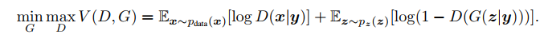
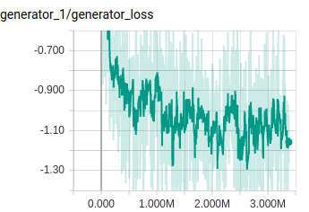
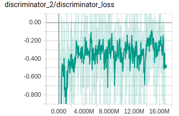
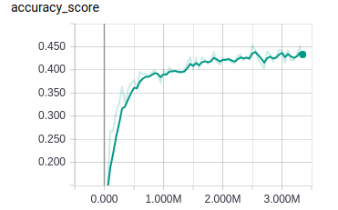

# Adversarial Feature Generation for Zero-Shot Learning

We try to generate synthetic data for unseen classes conditioned on class attributes. Training is done using wasserstein generative adversarial network.

### Architecture Diagram
<p align="center"></p>

### Loss Function


### Train
```
python train.py --logdir run_dir --train-dir /data/CUBNew
```

Parameters:
* iterations 
* batch_size 
* dropout 
* train_dir 
* logdir
* z_dim
* g_steps
* d_steps
* lr
* wgan
* log_interval

### Results
 


## Data

Link - (https://drive.google.com/file/d/1XIFik0Cv1MTWtQEQQUZygOwL-X-ZajKY/view?usp=sharing)

